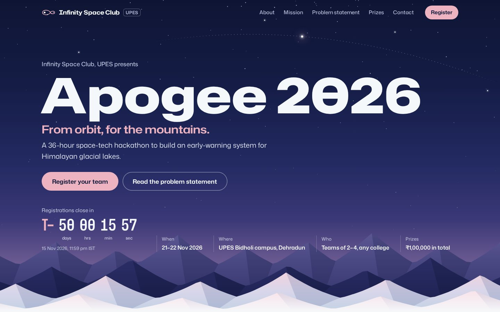

# Apogee 2026 registration site

A one-page registration site for **Apogee 2026**, a hypothetical 36-hour space-tech hackathon run by Infinity Space Club, UPES. Built as a design task: the event, dates, prizes and contacts are all placeholders.



**What's on the page:** event name and tagline, a live countdown to the registration deadline, About, Our mission, the problem statement (with two tracks, open datasets and judging criteria), prizes, and contact details. The **Register** button in the header, and every other register button, opens a registration popup.

Plain HTML, CSS and JavaScript. No frameworks, no build step, and it works on phones.

## Files

```
index.html        the page, including the registration popup
css/style.css     all styles
js/script.js      header, countdown, popup and form handling
assets/           star field, mountain ridges, icons
fonts/            Mona Sans and Hubot Sans (self-hosted, SIL Open Font License)
docs/preview.jpg  the screenshot above
```
